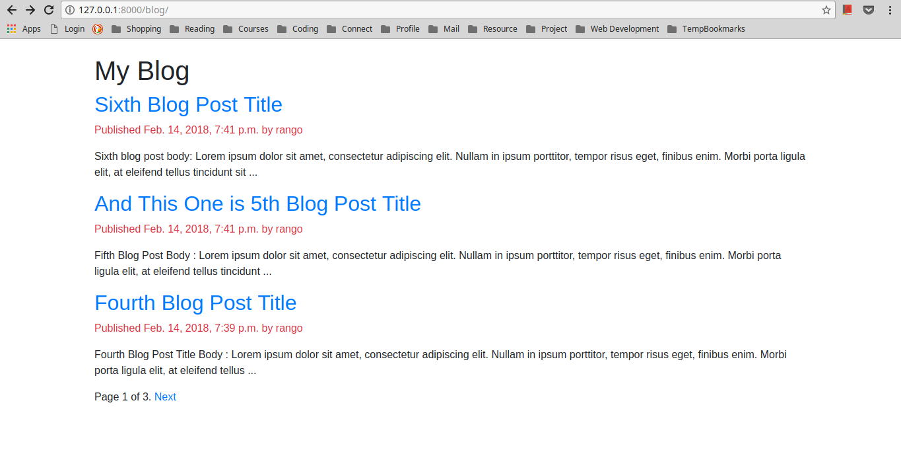

# Here I'll work on few django based web projects for 100 days continuously from 14-February-2018 to 25-May-2018.
I'll edit this README every day when I'll finish working for that day.

| Day      | Project Name |         What I learned/did                                           | Link        |
|----------|--------------|----------------------------------------------------------------------|-------------|
| Day001   14/02/2018  | Blog App     | How to customize the way models are displayed in admin panel. Creating model Managers. How to create canonical URLs for models. How to add django's build in pagination. How to create class based view. Creating form. | [Blog App](https://github.com/akashgiricse/100DaysOfDjango/tree/master/BlogApp) |
| Day002   15/02/2018 | Blog App | Difference between Form and ModelForm. More template tag (like  etc.). Many-to-one relationship. | [Blog App](https://github.com/akashgiricse/100DaysOfDjango/tree/master/BlogApp) |
| Day003   16/02/2018 | Blog App | I learned how to integrate third party app to the project. I used **[taggit](https://github.com/alex/django-taggit)** third-party Django tagging application. Build complex QuerySets to retrieve objects by similarity. More template tags practice. | [Blog App](https://github.com/akashgiricse/100DaysOfDjango/tree/master/BlogApp) |
| Day004   17/02/2018 | Blog App | Learned how to use custom tempate tags. | [Blog App](https://github.com/akashgiricse/100DaysOfDjango/tree/master/BlogApp) |
| Day005   18/02/2018 | Blog App | More practice on custom template tags. Learned how to use simple_tag, inclusion_tag, assignment_tag. How to use custom template filters, I used Markdown tempate filter. | [Blog App](https://github.com/akashgiricse/100DaysOfDjango/tree/master/BlogApp) |
| Day006   19/02/2018 | Blog App | Learned how to add a sitemep and it's importance to a site. How to configure and add RSS feed to the site. Started working on adding a search engine with Solr and Haystack | [Blog App](https://github.com/akashgiricse/100DaysOfDjango/tree/master/BlogApp) |
| Day007   20/02/2018 | Blog App | Revisited every concept used in this blog. I'll implement search engine after some time, so that I can revisit this project again. The next project is a Social media clone project. Will fix the two errors in the revision. | [Blog App](https://github.com/akashgiricse/100DaysOfDjango/tree/master/BlogApp) |
| Day008   21/02/2018 | Social Website | Learned how to use Django authentication framework. How to create login view and setting up the urls and template for the login. | [Social Website](https://github.com/akashgiricse/100DaysOfDjango/tree/master/SocialWebsite) |
| Day009   22/02/2018 | Social Website | Learned how to use Django authentication views, how to create login/logout view. | [Social Website](https://github.com/akashgiricse/100DaysOfDjango/tree/master/SocialWebsite) |
| Day010   23/02/2016 | Social Website | Learned how to use Django authentication views and to implement them in templates. How to set static files path in django setting file. | [Social Website](https://github.com/akashgiricse/100DaysOfDjango/tree/master/SocialWebsite) |
| Day011   24/02/2018 | Social Website | More django authentication views practice. | [Social Website](https://github.com/akashgiricse/100DaysOfDjango/tree/master/SocialWebsite) |
| Day012   25/02/2018 | Social Website | Learned how to Change password and Reset password using django's inbuild authentication views. How to get a password reset link in the consol. | [Social Website](https://github.com/akashgiricse/100DaysOfDjango/tree/master/SocialWebsite) |
| Day013   26/02/2018 | Social Website | Learned how to design registration page using django. How to validate user_registration form and render user objects in templates. | [Social Website](https://github.com/akashgiricse/100DaysOfDjango/tree/master/SocialWebsite) |
| Day014   27/02/2018 | Social Website | How to manage static Media file, how to extend user model to define our own fields and how to link them with build in user model. User of [Pillow](https://pillow.readthedocs.io/en/latest/) module for handling Images in django. | [Social Website](https://github.com/akashgiricse/100DaysOfDjango/tree/master/SocialWebsite) |
| Day015   28/02/2018 | Social Website | How to use custom User model. How to display messages using message framework. How to build a custom authentication backend. How to add social authentication to the site (i.e. Twitter, Google etc) | [Social Website](https://github.com/akashgiricse/100DaysOfDjango/tree/master/SocialWebsite) |
| Day016   01/03/2018 | Social Website | More practice on authentication, read docs. | [Social Website](https://github.com/akashgiricse/100DaysOfDjango/tree/master/SocialWebsite) |
| Day017   02/03/2018 | Social Website | To create basic Image model. When and why create Index in database. Creating ManyToMany relationship | [Social Website](https://github.com/akashgiricse/100DaysOfDjango/tree/master/SocialWebsite) |
| Day018   03/03/2018 | Social Website | Validating extentions in form. How to use urllib module to download image | [Social Website](https://github.com/akashgiricse/100DaysOfDjango/tree/master/SocialWebsite) |
| Day019   04/03/2018 | Social Website | Learned basics of jQuery. No contribution to the project. | [Social Website](https://github.com/akashgiricse/100DaysOfDjango/tree/master/SocialWebsite) |
| Day020   05/03/2018 | Social Website | Practiced JavaScript. | [Social Website](https://github.com/akashgiricse/100DaysOfDjango/tree/master/SocialWebsite) |
| Day021   06/03/2018 | Social Website | Practiced JavaScript. How to implement javascript in template. How bookmarklet works | [Social Website](https://github.com/akashgiricse/100DaysOfDjango/tree/master/SocialWebsite) |
| Day022   07/03/2018 | Let's Quiz | Paused working on Social Website and started contributing to my personal project [Let's Quiz](https://github.com/akashgiricse/lets-quiz/). P.S. I did not update this readme for 6 days, updating all at once till date 12/03/2018 | [Let's Quiz](https://github.com/akashgiricse/lets-quiz/) |
| Day023   08/03/2018 | Let's Quiz | Mainly worked on front-end. Learned how to use third party utility for login/logout/registration. I used [django-bootstrap4](http://django-bootstrap4.readthedocs.io/en/latest/) for the same. Also how to server static files in django app. | [Let's Quiz](https://github.com/akashgiricse/lets-quiz/) |
| Day024   09/03/2018 | Let's Quiz | Learned how to write documentation. How to customize django admin login page. | [Let's Quiz](https://github.com/akashgiricse/lets-quiz/) |
| Day025   10/03/2018 | Let's Quiz | Worked on some test cases. For example if user is logged in, he/she should not be able to see registration/signup page again if he/she navigate to the signup page manually in url bar of the browser. And learned how to style forms in template using [django-crispy-forms](http://django-crispy-forms.readthedocs.io/en/latest/). | [Let's Quiz](https://github.com/akashgiricse/lets-quiz/) |
| Day026   11/03/2018 | Let's Quiz | Learned how to design custom error 404, 500 page in django. | [Let's Quiz](https://github.com/akashgiricse/lets-quiz/) |
| Day027   12/03/2018 | Let's Quiz | Learned web scraping basics, working with JSON files. And how to integrate everythink together, i.e. python, json, scrapped data etc. Revisited "working with files in python" | [Let's Quiz](https://github.com/akashgiricse/lets-quiz/) |
| Day028   13/03/2018 | Let's Quiz | Wrote a script for getting address data using Google API. Learning web scraping so that I can use it to crawl quiz data from other site to lead it into my site | [Link for work](https://github.com/akashgiricse/ScriptsUsingPython/tree/master/GetAddressDataUsingGoogleAPI) |
| Day029   14/03/2018 | Let's Quiz | More web scraping practice, wrote script for finding currency value of other country in terms of USD. More JSON reading/writing data practice.| [Link for work](https://github.com/akashgiricse/ScriptsUsingPython/tree/master/CurrencyValueFinderAPI) |
| Day030   15/03/2018 | Let's Quiz | How to define our own custom user model. How to use build in django user model to let the user edit his profile info. How to deal with media files. | [Let's Quiz](https://github.com/akashgiricse/lets-quiz/) |
| Day031   16/03/2018 | Let's Quiz | More web scraping practice. | [Link for work](https://github.com/akashgiricse/ScriptsUsingPython/tree/master/1.HelpMaterial/BeautifulSoutAndRequests/ScrapeCoreyMS.com) |
| Day032   17/03/2018 | Let's Quiz | Finished first three chapters of Two Scoops of Django. Learned what is the importance of PostgreSQL over SQLite3, learned importance of virtualenv, virtualenvwrapper, version control in more detail. Learned how to lay out Django projects in chapter 3. | N/A |
| Day033   18/03/2018 | Blog App | Worked on front-end. | [Blog App](https://github.com/akashgiricse/100DaysOfDjango/tree/master/BlogApp) |
| Day034   19/03/2018 | Let's Quiz | Finished chapter 4,5 of Two Scoops of Django. Learned how to configure multiple settings files and what is importance using multiple settings files. | N/A |
| Day035   20/03/2018 | Let's Quiz | Started chapter 6 of Two Scoops of Django. Learned type of model inheritance i.e. [Abstract base classes](https://docs.djangoproject.com/en/1.11/topics/db/models/#abstract-base-classes), [Multi-table inheritance](https://docs.djangoproject.com/en/1.11/topics/db/models/#multi-table-inheritance) and [Proxy models](https://docs.djangoproject.com/en/1.11/topics/db/models/#proxy-models). | N/A |
| Day036   21/03/2018 | Let's Quiz | Studied how to design an efficient Model in Django, Database Migrations, [Relational Database Design/Normalization](https://en.wikibooks.org/wiki/Relational_Database_Design/Normalization), Model Managers. | N/A |
| Day037   22/03/2018 | Let's Quiz | Finished chapter 6 of Two Scoops of Django. Started chapter 7 i.e. Queries and Database Layer | N/A |
| Day038   23/03/2018 | Let's Quiz | Finished chapter 7 of Two Scoops of Django. | N/A |

----------
### Screenshots
----------
#### 1. [Blog App](https://github.com/akashgiricse/100DaysOfDjango/tree/master/BlogApp)
**Home page:**

**Detailed view of a post:**

**Now posts have tagging functionality**

**Detailed view of a post with tagging and similar posts functionality**

**List view with custom template tags**

**Homepage with custom template tags and filters.**

**Homepage with RSS feed subscription link. (RSS feed is functioning as you can see in the RSS extention)**

#### 2. [Social Website](https://github.com/akashgiricse/100DaysOfDjango/tree/master/SocialWebsite)

**Login page**

**Login Page (without bootstrap, only using css)**

**Dashboard page after login**

**Password Reset pages**

**Auto generated password reset link in consol**

**User registration form**

**User profile edit form**

**Messages using django's message framework**

**Social Authentication feature**

#### 3. [Let's Quiz](https://github.com/akashgiricse/lets-quiz/)

